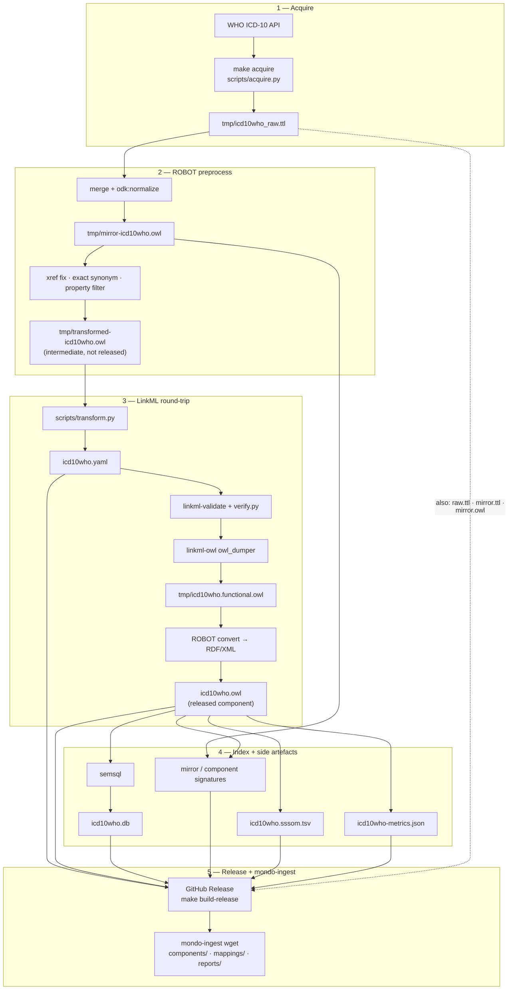

# icd10who

Preprocessed ICD-10 WHO source for Mondo ingest — LinkML YAML plus RDF/XML component OWL (and related release bundle) for [mondo-ingest](https://github.com/monarch-initiative/mondo-ingest).

## Setup

1. Register at [WHO ICD API](https://icd.who.int/icdapi) for OAuth2 client credentials.
2. Copy `env/.env.example` → `env/.env` and set `CLIENT_ID` and `CLIENT_SECRET`.
3. Install dependencies: `uv sync`
4. Align LinkML with the mondo-source-ingest pin (main-branch `linkml` / `linkml-runtime`, `linkml-owl` 0.5.0): `make dependencies`

## Run

```bash
make acquire       # WHO API → tmp/icd10who_raw.ttl (~2.5 hrs first run; cached after)
make build         # ROBOT preprocess → tmp/transformed-icd10who.owl
make build-release # YAML + RDF/XML OWL + .db + signatures/mappings/metrics (full release bundle)
make verify        # re-run structural checks on icd10who.yaml (after build-release)
```

**ROBOT:** needed on `PATH` (or use `obolibrary/odkfull` as in CI) for mirror/component/convert steps.

## Workflow



Same diagram as source: [`docs/icd10who-workflow.mmd`](docs/icd10who-workflow.mmd).

## Outputs

| File | Description |
|------|-------------|
| `icd10who.yaml` | Primary LinkML artefact |
| `icd10who.owl` | LinkML-derived component OWL as **RDF/XML** (released; functional dump stays in `tmp/`) |
| `icd10who.db` | semsql index over `icd10who.owl` for mondo-ingest QC/alignment |
| `icd10who.raw.ttl` / `icd10who.mirror.*` | Raw + normalized mirror assets |
| `reports/` · `mappings/` | Signatures, metrics, SSSOM (see [`docs/release-assets.md`](docs/release-assets.md)) |

ROBOT intermediate `tmp/transformed-icd10who.owl` is not released.

## Docs

| Doc | Contents |
|-----|----------|
| [`docs/icd10who-workflow.mmd`](docs/icd10who-workflow.mmd) | Mermaid workflow diagram |
| [`docs/plan.md`](docs/plan.md) | Pipeline architecture, field mappings, ID scheme |
| [`docs/release-assets.md`](docs/release-assets.md) | GitHub Release asset contract for mondo-ingest |
| [`docs/release_notes.md`](docs/release_notes.md) | Ontology stats and verification results per release |
| [`docs/pipeline_incidents.md`](docs/pipeline_incidents.md) | Pipeline incidents: errors, deviations, resolutions |

## CI secrets

GitHub Actions expects repository secrets `CLIENT_ID` and `CLIENT_SECRET` (same as `env/.env`).
